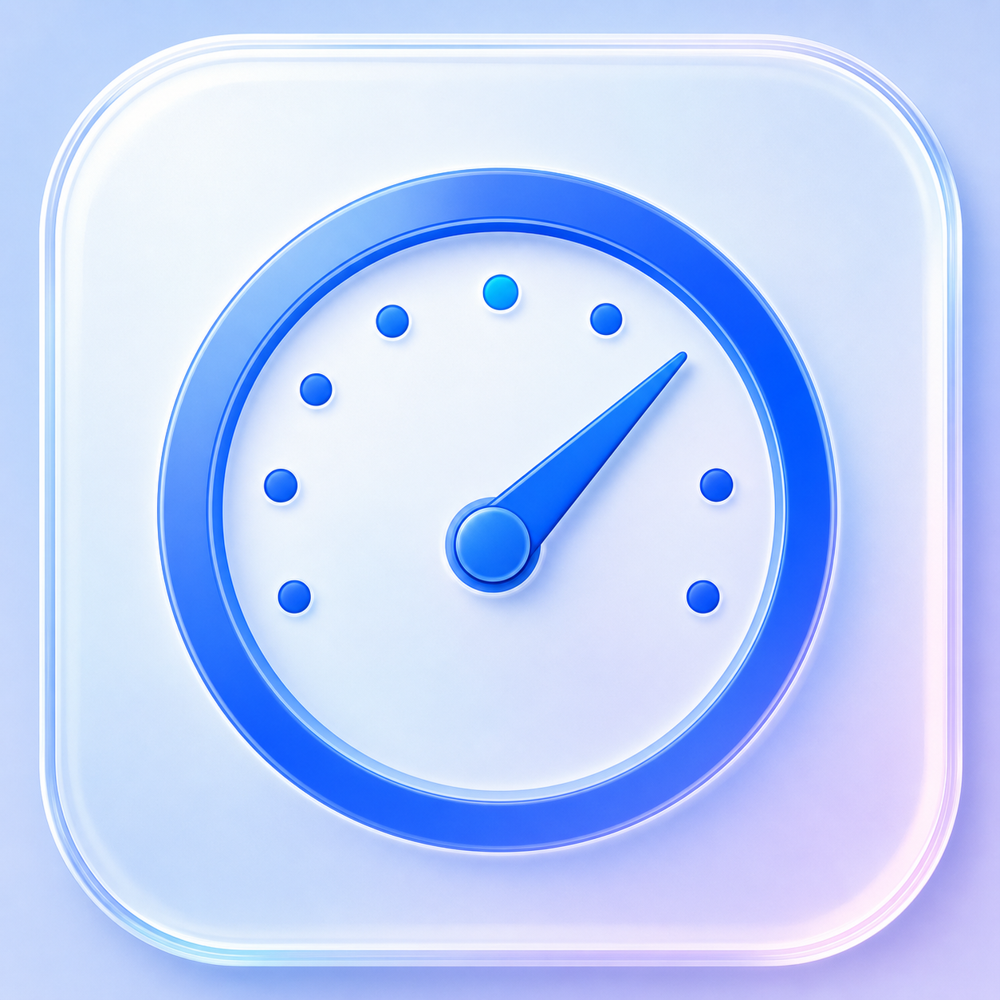
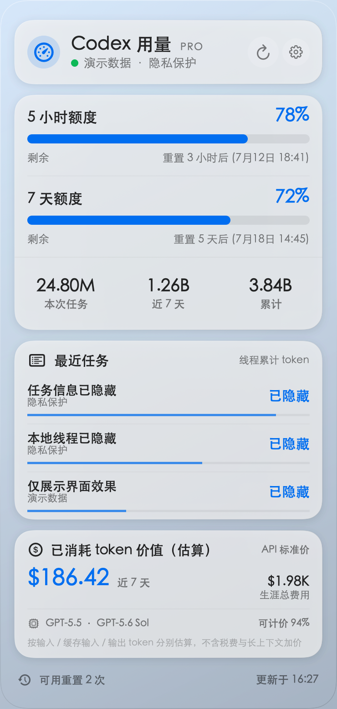
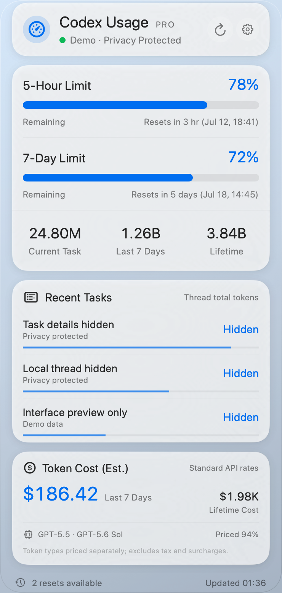

<p align="center">
  
</p>

# Codex Usage Monitor

<p align="center">
  <a href="#中文">中文</a> · <a href="#english">English</a>
</p>

<p align="center">
  
  
</p>

## 中文

一个原生 macOS 菜单栏 Codex 用量监控工具。点击菜单栏里的仪表图标和百分比，即可展开毛玻璃质感的额度、token 统计、最近任务和 API 等值费用面板。

菜单栏入口使用原生 `NSStatusItem`，弹层使用透明、无边框的自定义 `NSPanel`；窗口本身没有系统弹层底色，仅保留低强度的可控玻璃材质。

详细的数据来源、app-server 调用和费用计算过程请参阅：[运行原理与 Codex 用量数据说明](docs/HOW_CODEX_USAGE_MONITOR_WORKS_ZH.md)。

### 功能

- 实时显示 5 小时与每周 Codex 剩余额度和重置时间。
- 显示最近线程、当前线程、近 7 天及累计 token。
- 按模型的公开 API 标准价估算近 7 天与本机可见生涯 token 价值，普通输入、缓存输入和输出分别计价，并为历史用量冻结当时的价格快照；子任务继承的父线程上下文不会被重复计费。
- 通过右上角设置按钮选择显示的卡片，并可启用登录时自动启动。
- 支持中文与英文；首次启动匹配 macOS 首选语言，之后可在设置中随时切换并记住选择。
- 复用 Codex Desktop 登录状态，无需额外填写 API Key。
- 原生 AppKit + SwiftUI 菜单栏体验，支持自动与手动刷新。
- 固定优化后的 `NSVisualEffectView` 与 `ultraThinMaterial` 毛玻璃参数。

### 下载

从 [Releases](https://github.com/ower93/CodexUsageMonitor/releases/latest) 下载 `CodexUsageMonitor.app.zip`，解压后打开应用。

运行要求：macOS 14 或更高版本，并已安装且登录 `/Applications/Codex.app`。

### 构建与运行

```bash
./script/build_and_run.sh
```

脚本会使用当前 Xcode Command Line Tools 选中的 macOS SDK 构建 SwiftPM 工程，生成带应用图标的 `dist/CodexUsageMonitor.app`，然后启动应用。应用是菜单栏专用工具，不显示 Dock 图标。

### 真实数据来源

应用调用已安装 Codex 自带的本地 `app-server`，复用当前 Codex 登录状态，不保存或读取明文账号令牌：

- `account/rateLimits/read`：5 小时/7 天额度、重置时间、计划类型和可用重置次数。
- `account/usage/read`：近 7 天和账户累计 token。
- `thread/list`：最近更新的真实线程；每个线程的累计 token 从对应会话的最新 `token_count` 事件读取。

API 等值费用会扫描本机 `~/.codex/sessions` 与 `~/.codex/archived_sessions` 中可见的会话日志，根据每个事件发生时使用的模型，将普通输入、缓存输入和输出 token 分别估算。对于 Codex 子任务，应用会从父线程在派生时刻的累计用量中建立继承基线，只计算子任务真正新增的 token，避免复制的上下文被重复计价；如果旧日志缺少足够信息来可靠还原继承基线，该子任务会被保守地跳过，而不会把复制的父线程用量当成新增费用。计价账本保存在 `~/Library/Application Support/CodexUsageMonitor/token-cost-ledger.json`；每次只按当时价格记录新增 token，未来 API 调价不会重新计算已有历史。1.2 首次启动会备份旧账本并一次性重建事件级账本，之后恢复增量刷新。该金额不是实际账单，且不包含税费与长上下文加价。

应用启动时自动刷新，面板打开期间每 60 秒刷新一次，也可以点击右上角按钮手动刷新。

## English

Codex Usage Monitor is a native macOS menu bar app for tracking Codex limits, token usage, recent tasks, and estimated API-equivalent cost in a polished glass panel.

It uses a native `NSStatusItem` menu bar entry and a transparent, borderless custom `NSPanel`. The panel combines `NSVisualEffectView` background blur with carefully tuned SwiftUI materials.

### Features

- Live 5-hour and weekly Codex limits, remaining percentages, and reset times.
- Latest thread, last 7 days, and lifetime token totals.
- Estimated API-equivalent value based on public model pricing, with regular input, cached input, and output tokens priced separately, historical price snapshots preserved, and inherited parent context excluded from subagent cost.
- Card visibility controls and an optional Launch at Login setting.
- Chinese and English interfaces. The first launch follows the preferred macOS language; later manual selections are remembered.
- Reuses the existing Codex Desktop login session—no separate API key is required.
- Native AppKit + SwiftUI menu bar experience with automatic and manual refresh.
- Tuned `NSVisualEffectView` and `ultraThinMaterial` glass appearance.

### Download

Download `CodexUsageMonitor.app.zip` from the latest [GitHub Release](https://github.com/ower93/CodexUsageMonitor/releases/latest), unzip it, and open the app.

Requirements: macOS 14 or later, with `/Applications/Codex.app` installed and signed in.

### Build and Run

```bash
./script/build_and_run.sh
```

The script builds the SwiftPM project using the macOS SDK selected by Xcode Command Line Tools, creates `dist/CodexUsageMonitor.app`, and launches it. The app runs exclusively in the menu bar and does not show a Dock icon.

### Live Data Sources

The app talks to the local `app-server` bundled with Codex and reuses the current Codex login session. It does not store or read plaintext account tokens:

- `account/rateLimits/read`: 5-hour and 7-day limits, reset times, plan type, and available resets.
- `account/usage/read`: last-7-days and account lifetime token usage.
- `thread/list`: recently updated threads, with per-thread totals read from the latest `token_count` event in each session.

The API-equivalent estimate scans locally visible sessions under `~/.codex/sessions` and `~/.codex/archived_sessions` and prices each event using the model active at that point. For Codex subagents, it derives an inherited baseline from the parent session at the fork timestamp and charges only the child session's newly generated tokens, preventing copied context from being counted twice. If an older log does not contain enough information to reconstruct that baseline reliably, the child session is conservatively skipped instead of treating copied parent usage as new cost. Its ledger is stored at `~/Library/Application Support/CodexUsageMonitor/token-cost-ledger.json`. Only newly observed tokens are charged at the current recorded price, so later API price changes do not reprice existing history. On its first 1.2 launch, the app backs up the old ledger and performs a one-time event-level rebuild; later refreshes are incremental. It is an estimate—not a bill—and excludes taxes and long-context surcharges.

The app refreshes on launch, every 60 seconds while the panel is open, and whenever the refresh button is clicked.

## Development Preview

```bash
/Library/Developer/CommandLineTools/usr/bin/swift build \
  --disable-sandbox \
  --product PreviewRendererTool
```

The preview tool renders Chinese by default. Add `--english` for English and `--settings` to show the settings card. Chinese UI text uses STHeitiSC-Light / STHeitiSC-Medium.
