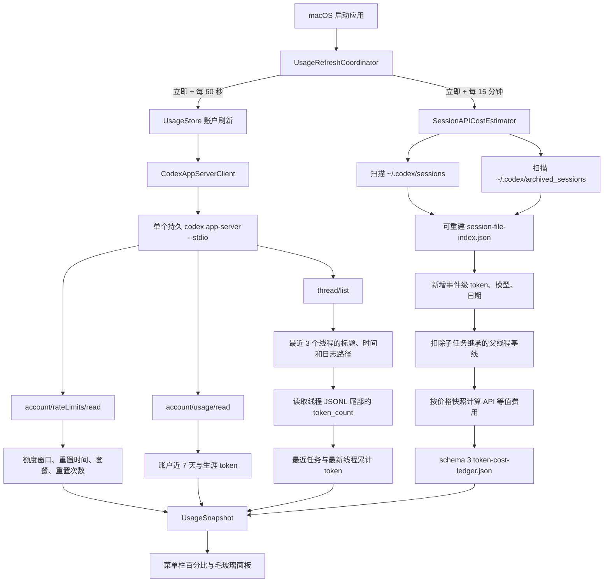

# Codex Usage Monitor 运行原理与用量数据说明

> 适用版本：Codex Usage Monitor v1.2.1（应用内部版本 `1.2.1 (4)`）
> 文档更新时间：2026-07-24

## 1. 一句话概括

Codex Usage Monitor 是一个原生 macOS 菜单栏应用。它不要求用户另填 OpenAI API Key，而是启动 Codex Desktop 自带的本地 `codex app-server` 进程，复用 Codex 当前登录状态获取账户额度、账户 token 用量和最近任务；同时读取本机 `~/.codex` 会话日志，显示线程累计 token，并估算这些本地可见 token 如果按公开 API 标准价计费，大约价值多少美元。

需要特别区分：

- **额度和账户累计 token**：来自 Codex `app-server` 返回的账户数据。
- **最近任务 token**：来自最近线程对应的本地 JSONL 会话日志。
- **Token Cost（估算）**：根据本机可见日志、模型和价格快照在本地计算，不是 OpenAI 实际账单。

## 2. 总体架构



## 3. 应用从启动到显示数据的过程

### 3.1 创建菜单栏应用

应用通过 AppKit 创建：

- `NSStatusItem`：菜单栏中的仪表图标和剩余百分比。
- 无边框 `NSPanel`：点击菜单栏图标后显示的浮动面板。
- `NSVisualEffectView`：面板底层背景模糊。
- SwiftUI：额度、最近任务、费用和设置卡片。

应用被设置为 `.accessory`，因此正常情况下不会显示 Dock 图标。

相关源码：

- [`CodexUsageMonitorApp.swift`](../Sources/CodexUsageMonitor/App/CodexUsageMonitorApp.swift)
- [`StatusBarController.swift`](../Sources/CodexUsageMonitor/App/StatusBarController.swift)
- [`TransparentUsagePanelController.swift`](../Sources/CodexUsageMonitor/App/TransparentUsagePanelController.swift)
- [`UsagePanelView.swift`](../Sources/CodexUsageUI/Views/UsagePanelView.swift)

### 3.2 创建数据仓库和统一刷新协调器

`UsageStore` 是界面数据的中心：

1. 启动时先创建一份占位快照。
2. `UsageRefreshCoordinator` 启动两条独立任务：账户刷新立即执行并每 60 秒重复，费用刷新立即执行并每 15 分钟重复。
3. 账户刷新通过 `CodexAppServerClient.fetchUsage()` 读取额度、账户 token 和最近线程。
4. 费用刷新以 utility 优先级在后台运行 `SessionAPICostEstimator`，不与 60 秒账户轮询绑定。
5. 成功结果被合并为 `UsageSnapshot`，SwiftUI 自动刷新。
6. 账户刷新失败时保留上一次成功数据，并显示橙色“刷新失败”状态。

账户刷新和费用刷新分别防止同类任务重入。`UsagePanelView` 只负责显示和把手动刷新动作交给协调器，不再持有自己的定时轮询 `Task`；因此反复打开、关闭面板不会叠加 60 秒轮询。

相关源码：

- [`UsageRefreshCoordinator.swift`](../Sources/CodexUsageUI/Stores/UsageRefreshCoordinator.swift)
- [`UsageStore.swift`](../Sources/CodexUsageUI/Stores/UsageStore.swift)
- [`UsageSnapshot.swift`](../Sources/CodexUsageUI/Models/UsageSnapshot.swift)

## 4. 如何获取 Codex 账户用量数据

这是应用最核心的数据链路。

### 4.1 定位 Codex 可执行文件

应用按顺序查找：

1. `/Applications/Codex.app/Contents/Resources/codex`
2. `/opt/homebrew/bin/codex`
3. `/usr/local/bin/codex`

找到第一个可执行文件后，用它启动本地服务：

```text
codex app-server --stdio
```

如果三个位置都找不到，应用会显示“未找到 Codex 应用”。

### 4.2 为什么不需要用户填写 API Key

应用没有直接读取、保存或展示 Codex 的明文登录令牌，也没有自己的 API Key 输入框。

它把请求发送给 Codex 自带的 `app-server`。`app-server` 负责复用 Codex Desktop 已有的登录状态和账户上下文。因此，用户需要先在 Codex Desktop 中登录。

需要注意：

- 本应用自身没有直接向 OpenAI API 发请求的网络客户端代码。
- `codex app-server` 在处理账户请求时，可能使用 Codex 自己的本地状态或现有网络会话。
- “本地 app-server”不等于所有数据都永远离线，只表示本应用与 Codex 之间通过本机进程和管道通信。

### 4.3 与 app-server 的通信方式

应用运行期间维护一个 `codex app-server --stdio` 子进程，并连接三个标准流：

- `stdin`：向 Codex 写入请求。
- `stdout`：逐行读取 JSON 响应。
- `stderr`：不进入响应管道，避免未消费的错误输出阻塞通信。

通信格式是以换行分隔的 JSON 消息。子进程建立后只初始化一次：

```json
{
  "id": 1,
  "method": "initialize",
  "params": {
    "clientInfo": {
      "name": "codex-usage-monitor",
      "title": "Codex Usage Monitor",
      "version": "1.2.1"
    },
    "capabilities": {
      "experimentalApi": true,
      "requestAttestation": false
    }
  }
}
```

初始化完成后，账户刷新会在同一个连接上反复发送：

```text
initialized
account/rateLimits/read
account/usage/read
thread/list
```

应用以单调递增的请求 `id` 识别响应。下表中的 ID 只是第一次刷新时的示意；后续刷新继续使用新的 ID，不会重复初始化：

| 第一次刷新示意 ID | 方法 | 用途 |
|---:|---|---|
| `2` | `account/rateLimits/read` | 额度窗口、已用百分比、重置时间、套餐和可用重置次数 |
| `3` | `account/usage/read` | 账户生涯 token 和每日 token 桶 |
| `4` | `thread/list` | 最近更新的 3 个线程及其日志路径 |

正常拿到数据后，连接保持打开，供下一次 60 秒刷新复用。如果响应超过限定时间、标准输出提前关闭或进程失效，客户端会关闭该会话并新建一次连接重试；它不会把失效进程无限留在后台。

初始化参数中启用了 `experimentalApi`，因此这些账户方法属于依赖 Codex 当前实现的接口。未来 Codex Desktop 更新如果调整方法名或返回结构，本应用也需要同步适配。

相关源码：

- [`CodexAppServerClient.swift`](../Sources/CodexUsageUI/Services/CodexAppServerClient.swift)

### 4.4 退出时如何回收 app-server

应用退出不是直接遗弃刷新任务或子进程。`AppDelegate` 会请求延后终止，等待以下有界清理完成：

1. 取消 60 秒账户循环和 15 分钟费用循环。
2. 关闭 `app-server` 的标准输入。
3. 给进程一个很短的正常 EOF 退出窗口；如果仍在运行，则发送正常终止信号。
4. 如果仍未退出，再强制终止；EOF、正常终止和强制终止共享最多 2 秒的总预算。
5. 关闭标准输出并完成应用退出。

单次 app-server 响应也有 12 秒超时，避免读取管道永久阻塞。

## 5. 每个界面数字具体来自哪里

### 5.1 5 小时和 7 天额度

数据来自：

```text
account/rateLimits/read
```

Codex 返回的是 `usedPercent`，应用显示的是剩余百分比：

```text
remainingPercent = 100 - usedPercent
```

结果会限制在 `0...100` 之间并取整。

额度标题不被写死为固定文字，而是根据 `windowDurationMins` 生成：

- `300` 分钟 → 5 小时额度
- `10,080` 分钟 → 7 天额度
- 其他整天或整小时窗口也可以自动显示

重置时间来自 `resetsAt` Unix 时间戳，再按照当前系统语言和本地时间显示为“几小时后 + 具体日期时间”。

### 5.2 套餐名称和可用重置次数

同样来自 `account/rateLimits/read`：

- `planType` → `PRO`、`PLUS`、`TEAM`、`BUSINESS` 或 `ENTERPRISE`
- `rateLimitResetCredits.availableCount` → 底部“可用重置 N 次”

### 5.3 近 7 天 token

数据来自：

```text
account/usage/read
```

Codex 返回每日用量：

```text
dailyUsageBuckets[]
  - startDate
  - tokens
```

应用按照当前 macOS 系统日历，把今天和之前 6 个自然日的桶相加，得到“近 7 天”。

这是账户接口提供的统计，不是简单把当前电脑上七天内的 JSONL 日志相加。

### 5.4 生涯累计 token

数据直接来自：

```text
account/usage/read → summary.lifetimeTokens
```

这是 Codex 账户维度的数据，也是主卡片“累计”数字的来源。

### 5.5 最新线程和最近任务

应用请求：

```text
thread/list
```

参数为：

```json
{
  "limit": 3,
  "sortKey": "updated_at",
  "sortDirection": "desc",
  "useStateDbOnly": true
}
```

Codex 返回线程 ID、名称或预览、更新时间和本地日志路径。应用：

1. 优先使用线程 `name`。
2. 没有名称时使用 `preview`。
3. 标题超过 24 个字符时截断。
4. 根据日志路径读取对应 JSONL 文件末尾最多 2 MB。
5. 从后向前寻找最新的 `event_msg → token_count`。
6. 读取 `total_token_usage.total_tokens` 作为线程累计 token。

因此，“最新线程”和“最近任务”显示的是**该线程日志里的累计 token**。

### 5.6 为什么最近任务 token 可能很大

Codex 的派生任务或子任务日志可能继承父线程上下文。最新的 `total_token_usage` 是日志累计值，因此最近任务卡片可能包含继承历史。

费用估算会专门扣除这部分继承基线，但最近任务卡片当前仍展示原始线程累计 token。两者用途不同：

- 最近任务卡片：展示日志报告的线程累计规模。
- 费用卡片：尽量只计算真正新增、可以归属于该任务的 token。

## 6. API 等值费用如何计算

### 6.1 它不是实际账单

费用卡片表示：

> 如果本机可见的 Codex token 按相应模型的公开 API 标准价计费，大约价值多少美元。

它不表示用户真的被收取了这笔费用，也不包含：

- 税费
- 长上下文附加费
- 未在本地日志中出现的使用
- 没有公开定价或应用尚未支持的模型价格

### 6.2 日志来源

应用扫描：

```text
~/.codex/sessions/**/*.jsonl
~/.codex/archived_sessions/*.jsonl
```

主要读取三类记录：

- `session_meta`：会话 ID、父会话 ID、派生时间。
- `turn_context`：当前使用的模型。
- `event_msg / token_count`：累计输入、缓存输入、输出和总 token。

费用扫描不会把用户消息正文或助手回复正文写入费用账本。

### 6.3 计价公式

每一段增量 token 分为：

```text
普通输入 = input_tokens - cached_input_tokens
缓存输入 = cached_input_tokens
输出     = output_tokens
```

费用公式：

```text
费用 =
  普通输入 / 1,000,000 × 普通输入单价
  + 缓存输入 / 1,000,000 × 缓存输入单价
  + 输出 / 1,000,000 × 输出单价
```

应用会保证缓存输入不超过总输入，并拒绝负数或倒退的 token 增量。

模型价格定义在：

- [`APICostLedger.swift`](../Sources/CodexUsageUI/Services/APICostLedger.swift)

### 6.4 按事件日期和当时模型记录

一次会话可能跨日期，也可能中途切换模型。应用在首次建立历史时会按：

```text
日期 + 模型
```

拆分费用记录，而不是只用文件最后的模型和最后修改日期给整段历史计价。

### 6.5 价格快照为什么必须保存

每条费用记录保存完整价格快照，包括：

- 价格版本
- 模型显示名称
- 普通输入单价
- 缓存输入单价
- 输出单价

未来 API 价格发生变化时：

- 已记录的历史 token 保持旧价格。
- 新增 token 使用新价格。
- 应用不会用今天的价格重新计算全部历史。

### 6.6 子任务继承基线

这是 v1.2 的关键修复。

当一个 Codex 子任务从父线程派生时，子任务 JSONL 可能携带父线程已经产生的累计 token。如果直接把子任务最后的累计值全部计价，会把父线程历史重复收费。

应用现在按以下逻辑处理：

1. 从子任务 `session_meta` 读取父线程 ID 和派生时间 `forkedAt`。
2. 在父线程日志中找到派生时间之前最后一条 `token_count`。
3. 把该值记为子任务的 `inheritedBaseline`。
4. 子任务可计价 token：

```text
子任务可计价累计 = 子任务原始累计 - inheritedBaseline
```

5. 再根据相邻事件的差值计算真正新增 token。

对于部分旧版 Codex 日志，如果父日志没有相应 token 事件，应用会尝试从子日志中找到派生时间之前的最后累计值。

如果仍然无法可靠还原基线，应用会跳过该派生任务的费用，而不是把整段继承历史误认为新增费用。这个选择可能造成保守低估，但可以避免严重高估。

相关源码：

- [`SessionUsageLogReader.swift`](../Sources/CodexUsageUI/Services/SessionUsageLogReader.swift)
- [`SessionAPICostEstimator.swift`](../Sources/CodexUsageUI/Services/SessionAPICostEstimator.swift)

## 7. 本地费用账本

账本保存在：

```text
~/Library/Application Support/CodexUsageMonitor/token-cost-ledger.json
```

账本 schema v3 主要包含：

### `revision`

账本每次与增量索引共同提交时都会推进 revision。索引记录自己对应的账本 revision；如果主账本从备份恢复、索引写入中断或两者版本不一致，应用会丢弃旧索引并重新核对日志，避免较新的游标跳过尚未写入账本的 token。

### `checkpoints`

每个会话保存：

- 最后处理的模型
- 最后处理的 token 累计值
- 子任务继承基线（如有）

它用于下次刷新时只处理新增部分。

### `records`

每条记录保存：

- 会话 ID
- 使用日期
- 模型
- token 分类
- 当时的价格快照
- 已冻结的美元估值

### 备份

正常保存前会维护：

```text
token-cost-ledger.json.backup
```

从旧 schema 迁移时还会生成带时间戳的备份，例如：

```text
token-cost-ledger-v2-backup-YYYYMMDD-HHmmss-SSS.json
```

迁移不会把全部历史按当前 API 价格重算。合法 UUID 会话的 records、价格快照和已冻结 USD 会原样保留；旧版已知的“完整 rollout 文件名作为 session ID”记录会被针对性移除并从日志重新建立，重建时优先复用这些记录中保存的历史价格快照。

如果主账本损坏，应用会尝试读取普通 `.backup`。如果主文件和备份都无法解析，费用估算返回空值，但额度、账户 token 和最近任务仍可继续刷新。

账本旁边还有一个性能索引：

```text
~/Library/Application Support/CodexUsageMonitor/session-file-index.json
```

它保存会话文件的设备与 inode、大小、修改时间、已处理到的完整行游标、连续性指纹，以及后续增量所需的会话元数据和 token 摘要。这个文件会跨应用启动保留，以免每 15 分钟重新读取全部日志，但它不是计价事实来源：

- `token-cost-ledger.json` 是费用和价格快照的持久事实。
- `session-file-index.json` 只是可丢弃、可重建的扫描缓存。
- 索引缺失、版本过旧或损坏时，应用会创建空索引并重新检查日志，不会用索引覆盖或重新定价已有账本记录。
- 索引 revision 必须与账本 revision 一致；主账本回退到 `.backup` 时，较新的索引会自动失效。
- 保存时先持久化账本，再让索引确认已消费的字节，避免索引领先于费用账本。

## 8. 首次扫描与后续增量刷新

### 首次建立或需要重建索引

应用需要遍历本机可见日志，建立：

- 会话描述
- 父子关系
- 继承基线
- 日期和模型切片
- 初始费用记录
- 每个日志文件的增量索引项

日志较多时，第一次费用刷新可能明显更慢。

旧 schema 升级会先保留合法会话的冻结记录；只有旧版已知的文件名键重复项需要按事件重新核对，因此不会把全部历史统一换成当前价格。

### 后续刷新

每 15 分钟费用刷新时，应用先对每个会话文件读取轻量文件事实，再决定是否打开正文：

1. 文件设备、inode、大小和纳秒级修改时间都未变化：复用索引结果，不打开 JSONL 正文。
2. 文件大小增加，且前缀与上次文件尾连续性指纹都匹配：从上次完整行游标继续，只解析新增的完整 JSONL 内容。
3. 文件被截断、同大小重写、inode 替换或连续性校验失败：只废弃并重建这个文件的索引项。
4. 新增 token 仍以账本 checkpoint 为边界写入 schema 3 账本，并冻结当时价格快照。

索引使用文件身份和内容指纹，而不是只相信修改时间或文件大小。这让追加读取保持增量，同时避免把被替换或改写的日志误当成原文件续写。

如果日志被临时截断或累计值倒退，应用不会重置 checkpoint，也不会把恢复后的历史再次收费。

## 9. 更新频率

1.2.1 由 `UsageRefreshCoordinator` 统一管理刷新：

1. **账户与最近任务**：应用启动后立即刷新，此后每 60 秒调用同一个持久 app-server 连接。
2. **API 等值费用**：应用启动后立即刷新，此后每 15 分钟运行一次本地增量扫描。
3. **手动刷新**：用户点击右上角刷新按钮，或右键菜单栏图标选择“刷新用量”时，请求上述两类刷新。

两条循环互相独立：费用扫描较慢时，不需要等待下一个 60 秒账户周期才会继续更新额度。界面视图本身没有轮询 `Task`，打开或隐藏面板不会改变刷新任务数量。

界面上的“实时刷新”仍应理解为定时轮询和手动刷新，不是 WebSocket 或系统级实时订阅。退出时协调器会取消两条循环，并等待 app-server 完成有界回收。

## 10. 为什么不同位置的数字可能不一致

| 数字 | 数据范围 | 常见差异原因 |
|---|---|---|
| 账户累计 token | Codex 账户接口 | 可能包括其他设备、已经删除的本地日志或当前电脑不可见的历史 |
| 近 7 天 token | 账户每日用量桶 | 由账户统计，不等于本机七天日志简单求和 |
| 最近任务 token | 单个本地线程最新累计 | 派生线程可能包含继承上下文 |
| 生涯费用估算 | 当前电脑可见且可可靠解析、可定价的日志 | 本地日志缺失、未知模型、无法还原子任务基线时会低于账户累计范围 |
| 可计价百分比 | 有已知价格的观察 token / 全部观察 token | 未支持或无公开价格的模型会降低覆盖率 |

因此，费用卡不应该用“账户累计 token × 一个统一单价”计算。不同模型、普通输入、缓存输入、输出、价格生效时间以及子任务继承关系都需要分别处理。

## 11. 隐私与本地数据边界

应用会接触：

- Codex 返回的额度和账户用量摘要。
- 最近线程的名称或预览。
- 本地会话 JSONL 中的元数据、模型和 token 统计。

应用不会：

- 要求用户输入 OpenAI API Key。
- 把明文账号令牌保存到自己的配置文件。
- 把聊天正文写入费用账本。
- 把费用账本上传到本项目自己的服务器；本项目没有独立后端。

本地账本保存的是会话 ID、日期、模型、token 数、价格快照和美元估值。最近任务标题会显示在界面上，但不会写入费用账本。

增量索引保存文件身份、路径、游标、会话父子元数据和 token 摘要，不保存聊天正文。它与费用账本一样只位于本机应用支持目录，不会由本项目上传。

## 12. 常见故障

### 显示“未找到 Codex 应用”

检查 Codex 是否位于：

```text
/Applications/Codex.app
```

或是否安装了：

```text
/opt/homebrew/bin/codex
/usr/local/bin/codex
```

### 显示“刷新失败”

常见原因：

- Codex Desktop 尚未登录。
- Codex 版本不支持当前 app-server 方法。
- app-server 启动失败。
- 账户接口暂时没有返回额度或用量。

刷新失败不会主动清空上一次成功快照。

### 额度正常但费用显示为空

说明账户 app-server 请求成功，但本地费用估算失败。可能原因：

- `~/.codex` 日志不存在或不可读。
- 费用账本损坏且备份也不可恢复。
- 本地日志没有可定价模型。
- 所有可见派生任务都缺少可靠继承基线。

### 朋友的应用没有读取到数据

需要确认：

1. 对方安装的是最新 Release。
2. Codex Desktop 安装在 `/Applications`。
3. 对方已经在 Codex Desktop 登录。
4. 对方实际使用 Codex 后，本机存在 `~/.codex/sessions` 日志。
5. macOS 没有阻止应用启动。

账户额度依赖 app-server；费用估算和线程累计还依赖本地会话日志，两部分任一缺失都会导致界面只显示部分数据。

## 13. 关键源码索引

| 文件 | 职责 |
|---|---|
| [`CodexAppServerClient.swift`](../Sources/CodexUsageUI/Services/CodexAppServerClient.swift) | 启动 app-server、发送账户请求、解析额度/用量/线程 |
| [`UsageRefreshCoordinator.swift`](../Sources/CodexUsageUI/Stores/UsageRefreshCoordinator.swift) | 管理 60 秒账户循环、15 分钟费用循环、手动刷新和退出清理 |
| [`UsageStore.swift`](../Sources/CodexUsageUI/Stores/UsageStore.swift) | 分别管理账户与费用刷新状态、成功快照和错误 |
| [`CodexLiveUsage.swift`](../Sources/CodexUsageUI/Models/CodexLiveUsage.swift) | 真实用量数据模型和界面快照转换 |
| [`SessionUsageLogReader.swift`](../Sources/CodexUsageUI/Services/SessionUsageLogReader.swift) | 流式解析 JSONL、模型事件和子任务基线 |
| [`SessionAPICostEstimator.swift`](../Sources/CodexUsageUI/Services/SessionAPICostEstimator.swift) | 扫描日志、增量更新和汇总费用 |
| [`SessionFileIndex.swift`](../Sources/CodexUsageUI/Services/SessionFileIndex.swift) | 持久但可重建的文件身份、游标和连续性索引 |
| [`APICostLedger.swift`](../Sources/CodexUsageUI/Services/APICostLedger.swift) | 模型价格、计价公式、价格快照和账本持久化 |
| [`UsagePanelView.swift`](../Sources/CodexUsageUI/Views/UsagePanelView.swift) | 卡片显示，并把手动刷新操作交给统一协调器 |
| [`LaunchAtLoginService.swift`](../Sources/CodexUsageUI/Services/LaunchAtLoginService.swift) | 使用 `SMAppService` 管理登录时启动 |

## 14. 构建方式

项目是 Swift Package Manager macOS 工程，要求 macOS 14 或更高版本。

```bash
./script/build_and_run.sh
```

脚本会：

1. 使用当前 Xcode 选择的 macOS SDK 构建 `CodexUsageMonitor`。
2. 创建 `.app` bundle 和 `Info.plist`。
3. 加入应用图标。
4. 清理扩展属性。
5. 使用临时 ad-hoc 签名。
6. 验证签名并启动应用。

当前公开 Release 是 ad-hoc 签名且未经过 Apple notarization。首次打开若被 Gatekeeper 阻止，需要按住 Control 点击应用并选择“打开”。

---

如需把本文导出为 PDF、图片或其他固定版式文件，中文字体应使用 **STHeiti**。
